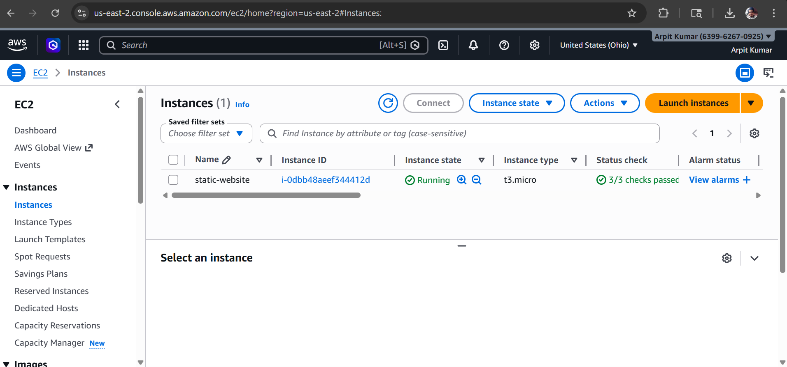
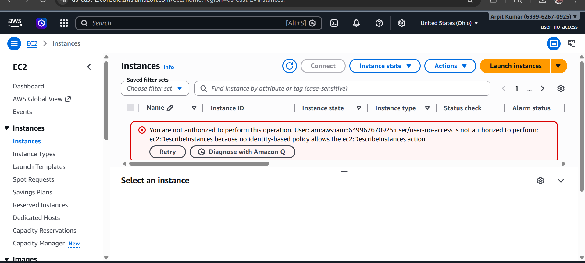
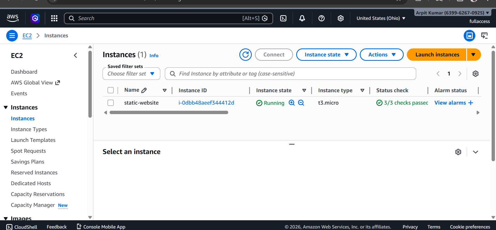

 AWS EC2 Static Website Hosting with IAM Access Control

🔗 Live Project

👉 http://3.151.244.254

## 🌐 Deployment Details

* EC2 Instance Type: t2.micro (Free Tier)
* OS: Ubuntu
* Web Server: Apache2
* Public Access via Elastic IP

---

## 📸 Screenshots

### 🖥️ EC2 Instance (Admin Access)

* Shows running instance with public details
  

---

### 🔐 IAM User 1 (No Access)

* User: `user-no-access`
* Result:  Cannot access EC2 services
  

---

### 🔓 IAM User 2 (EC2 Access)

* User: `fullaccess`
* Policy: `AmazonEC2FullAccess`
* Result:  Can view EC2 instances
 

## ⚠️ Challenges Faced

* ❌ SSH connection issue (`chmod` not working on PowerShell)
* ❌ .pem file not found due to incorrect directory
* ❌ Git clone created subfolder instead of root deployment
* ❌ Initial confusion with AWS regions during IAM login
* ❌ Security group configuration (HTTP port 80 not enabled initially)

---

## 👨‍💻 Author

**Arpit Kumar**
B.Tech CSE Student
